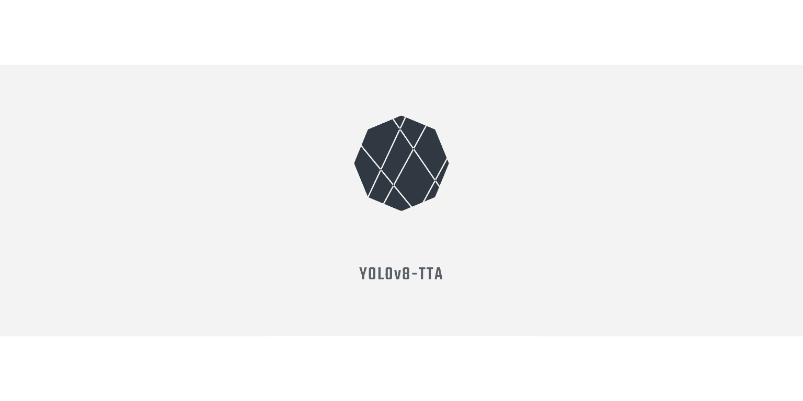
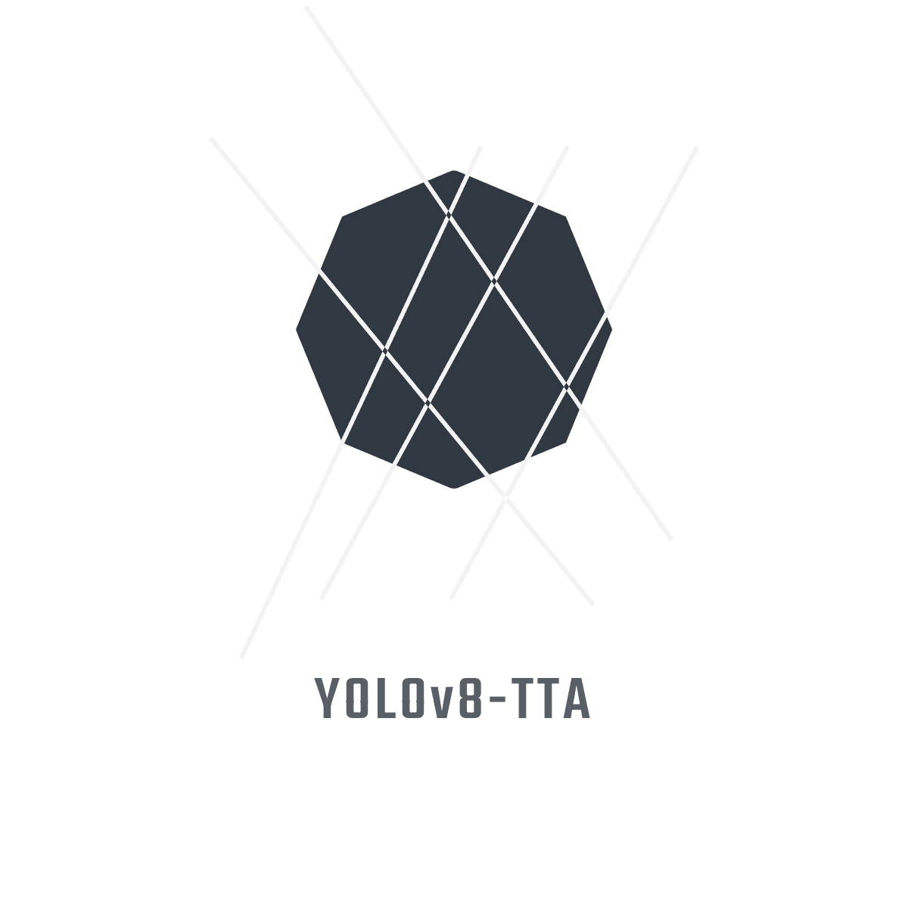

<div align="center">
  <p align="center">
    
  </p>
  <h1>YOLOv8-TTA: Test-time Adaptation Improvements for Object Detection</h1>
  <p>Test-time Adaptation Improvements Based on YOLOv8(v8.1.0)</p>
</div>

  <p align="center">
    
    
    
  </p>

English | [简体中文](README.zh-CN.md)

## 🌟 Key Features

- 🚀 **Lightweight Design**: Adapter parameters only account for 0.54%–0.89% of total model parameters
- 🎯 **Dual Alignment**: Innovative image-level and object-level feature alignment strategies
- ⚡ **Dynamic Updates**: Intelligent update mechanism based on distribution differences, reducing unnecessary computations
- 📈 **Significant Improvements**: 7.9% mAP increase and over 109.9% FPS improvement on COCO dataset

## 📝 Method Overview

This project proposes a new test-time adaptation method for object detection, addressing three core issues:

| Core Issue         | Solution            | Advantage                          |
| ------------------ | ------------------- | ---------------------------------- |
| **What to Update** | Lightweight Adapter | Small parameters, easy to optimize |
| **How to Update**  | Feature Alignment   | Dual alignment, better performance |
| **When to Update** | Dynamic Mechanism   | Computationally efficient          |

## 🛠️ Quick Start

### Environment Setup

```bash
# Clone repository
git clone https://github.com/LeafEvans/YOLOv8-TTA.git
cd YOLOv8-TTA

# Create and activate conda environment
conda create -n yolov8-tta python=3.10
conda activate yolov8-tta

# Install dependencies
pip install -e .
```

### Basic Usage

```python
from ultralytics import YOLO

# 1. Load model
model = YOLO("yolov8n.pt")

# 2. Configure TTA parameters
tta_params = {
    'alpha': 0.01,       # Feature update rate
    'tau1': 1.1,         # Major distribution shift threshold
    'tau2': 1.05,        # Minor distribution shift threshold
    'momentum': 0.99,    # EMA momentum
    'reduction_ratio': 32 # Adapter compression ratio
}

# 3. Train
results = model.train(
    data="data.yaml",
    epochs=100,
    imgsz=640,
    batch=16,
    tta=True,
    tta_params=tta_params
)

# 4. Predict
results = model.predict(
    source="images/",  # Path to images, dir, URL, video, etc.
    tta=True,         # Enable test-time adaptation
    tta_params=tta_params,
    conf=0.25,        # Confidence threshold
    save=True         # Save results
)

# 5. Validate
metrics = model.val(
    data="data.yaml",
    tta=True,
    tta_params=tta_params,
    batch=32
)

print(f"mAP50-95: {metrics.box.map}")    # Print mAP50-95
print(f"mAP50: {metrics.box.map50}")     # Print mAP50
print(f"mAP75: {metrics.box.map75}")     # Print mAP75
```

## 📊 Performance Comparison

### Results on COCO Dataset

| Method         | mAP      | AP50     | AP75     | FPS       |
| -------------- | -------- | -------- | -------- | --------- |
| YOLOv8         | 45.2     | 62.3     | 49.2     | 82.5      |
| **YOLOv8-TTA** | **53.1** | **70.1** | **57.8** | **173.2** |
| Improvement    | +7.9     | +7.8     | +8.6     | +109.9%   |

### Adaptation Effects in Different Scenarios

| Scenario Type | Baseline | TTA   | Relative Gain |
| ------------- | -------- | ----- | ------------- |
| Low Light     | 31.5%    | 38.2% | +6.7%         |
| Rainy         | 28.7%    | 35.9% | +7.2%         |
| Foggy         | 25.4%    | 32.8% | +7.4%         |
| Night         | 22.1%    | 29.6% | +7.5%         |

## 🔬 Technical Details

### Lightweight Adapter Structure

```plaintext
Input Features (C×H×W)
    ↓
1×1 Conv (C→C/r)
    ↓
ReLU
    ↓
1×1 Conv (C/r→C)
    ↓
Output Features (C×H×W)
```

### Optimization Objectives

Image-level alignment loss:

$$
L_{\text{img}} = D_{KL}(\mathcal{N}(\mu_{tr}, \Sigma_{tr}) \| \mathcal{N}(\mu_{te}, \Sigma_{tr}))
$$

Object-level alignment loss:

$$
L_{\text{obj}} = \sum_{k} w_k \cdot D_{KL}(\mathcal{N}(\mu_{k}^{tr}, \Sigma_{k}^{tr}) \| \mathcal{N}(\mu_{k}^{te}, \Sigma_{k}^{tr}))
$$

## 📚 Citation

If you use our code or method, please cite:

```bibtex
@misc{evans2024yolov8tta,
    title={YOLOv8-TTA: Test-time Adaptation Improvements for Object Detection},
    author={LeafEvans},
    year={2024},
    publisher={GitHub},
    url={https://github.com/LeafEvans/YOLOv8-TTA}
}
```

## 🤝 Contributing

Issues and Pull Requests are welcome!

## 📄 License

This project is licensed under [AGPL-3.0](LICENSE).

## 📬 Contact

- 📧 Email: leafevans@foxmail.com
- 💬 Feedback: [GitHub Issues](https://github.com/LeafEvans/YOLOv8-TTA/issues)

<div align="right">
<br>
Developed based on YOLOv8(v8.1.0)<br>
Author: LeafEvans
</div>
