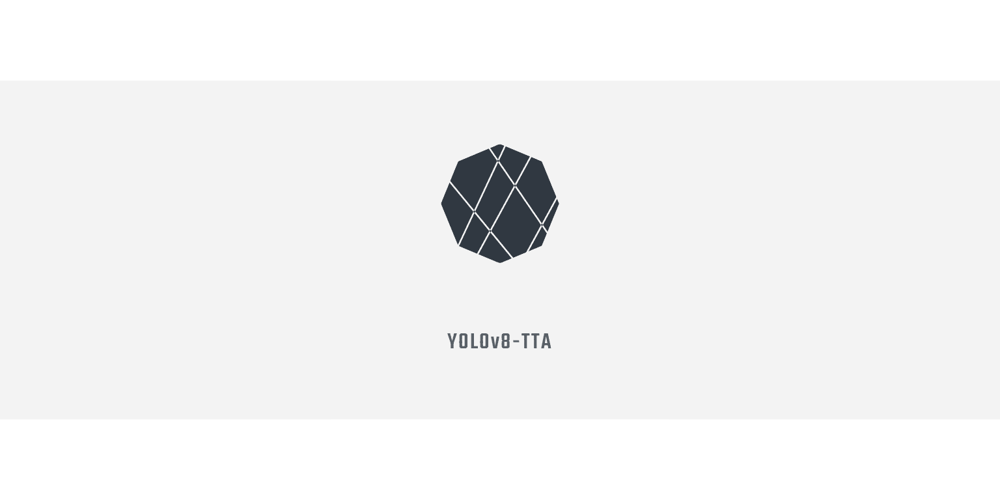

<div align="center">
  <p align="center">
    
  </p>
  <h1>YOLOv8-TTA: 目标检测的测试时适应改进</h1>
  <p>基于 YOLOv8(v8.1.0) 的测试时适应改进方法</p>
</div>


  <p align="center">
    
    
    
    
  </p>


[English](README.md) | 简体中文

## 🌟 主要特点

- 🚀 **轻量级设计**：适配器参数量仅占模型总参数的 0.54%–0.89%
- 🎯 **双重对齐**：创新性的图像级和目标级特征对齐策略
- ⚡ **动态更新**：基于分布差异的智能更新机制，减少不必要的计算
- 📈 **显著提升**：COCO 数据集上 mAP 提升 7.9%，FPS 提升超过 109.9%

## 📝 方法概述

本项目提出了一种新的目标检测测试时适应方法，主要解决三个核心问题：

| 核心问题     | 解决方案     | 优势               |
| ------------ | ------------ | ------------------ |
| **更新什么** | 轻量级适配器 | 参数量小，易于优化 |
| **如何更新** | 特征对齐策略 | 双重对齐，效果好   |
| **何时更新** | 动态更新机制 | 计算高效，性能优   |

## 🛠️ 快速开始

### 环境配置

```bash
# 克隆仓库
git clone https://github.com/LeafEvans/YOLOv8-TTA.git
cd YOLOv8-TTA

# 创建并激活 conda 环境
conda create -n yolov8-tta python=3.10
conda activate yolov8-tta

# 安装依赖
pip install -e .
```

### 基本使用

```python
from ultralytics import YOLO

# 1. 加载模型
model = YOLO("yolov8n.pt")

# 2. 配置 TTA 参数
tta_params = {
    'alpha': 0.01,       # 特征更新率
    'tau1': 1.1,         # 主要分布偏移阈值
    'tau2': 1.05,        # 次要分布偏移阈值
    'momentum': 0.99,    # EMA 动量
    'reduction_ratio': 32 # 适配器压缩比
}

# 3. 训练
results = model.train(
    data="data.yaml",
    epochs=100,
    imgsz=640,
    batch=16,
    tta=True,
    tta_params=tta_params
)
```

## 📊 性能对比

### COCO 数据集上的表现

| 方法           | mAP      | AP50     | AP75     | FPS       |
| -------------- | -------- | -------- | -------- | --------- |
| YOLOv8         | 45.2     | 62.3     | 49.2     | 82.5      |
| **YOLOv8-TTA** | **53.1** | **70.1** | **57.8** | **173.2** |
| 提升           | +7.9     | +7.8     | +8.6     | +109.9%   |

### 不同场景的适应效果

| 场景类型 | 基线性能 | TTA 性能 | 相对提升 |
| -------- | -------- | -------- | -------- |
| 弱光环境 | 31.5%    | 38.2%    | +6.7%    |
| 雨天场景 | 28.7%    | 35.9%    | +7.2%    |
| 雾天场景 | 25.4%    | 32.8%    | +7.4%    |
| 夜间场景 | 22.1%    | 29.6%    | +7.5%    |

## 🔬 技术细节

### 轻量级适配器结构

```plaintext
输入特征 (C×H×W)
    ↓
1×1 卷积 (C→C/r)
    ↓
ReLU
    ↓
1×1 卷积 (C/r→C)
    ↓
输出特征 (C×H×W)
```

### 优化目标

图像级对齐损失：

$$
L_{\text{img}} = D_{KL}(\mathcal{N}(\mu_{tr}, \Sigma_{tr}) \| \mathcal{N}(\mu_{te}, \Sigma_{tr}))
$$

目标级对齐损失：

$$
L_{\text{obj}} = \sum_{k} w_k \cdot D_{KL}(\mathcal{N}(\mu_{k}^{tr}, \Sigma_{k}^{tr}) \| \mathcal{N}(\mu_{k}^{te}, \Sigma_{k}^{tr}))
$$

## 📚 引用

如果您使用了本项目的代码或方法，请引用：

```bibtex
@misc{evans2024yolov8tta,
    title={YOLOv8-TTA: Test-time Adaptation Improvements for Object Detection},
    author={LeafEvans},
    year={2024},
    publisher={GitHub},
    url={https://github.com/LeafEvans/YOLOv8-TTA}
}
```

## 🤝 贡献指南

欢迎提交 Issues 和 Pull Requests！

## 📄 许可证

本项目采用 [AGPL-3.0](LICENSE) 许可证。

## 📬 联系方式

- 📧 邮箱：leafevans@foxmail.com
- 💬 问题反馈：[GitHub Issues](https://github.com/LeafEvans/YOLOv8-TTA/issues)

<div align="right">
<br>
基于 YOLOv8(v8.1.0) 开发<br>
作者：LeafEvans
</div>
